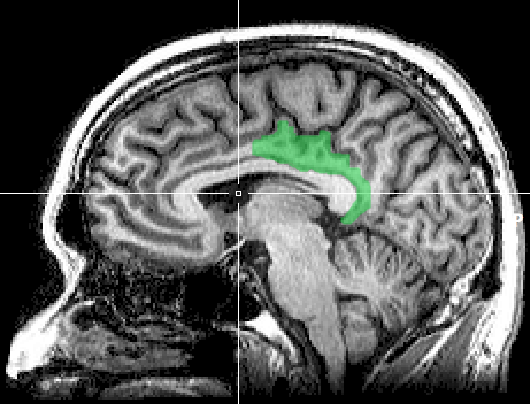

\newcommand{\indep}{\perp \!\!\! \perp}

```{r setup, include=FALSE}
knitr::opts_chunk$set(echo = FALSE, comment = NA,
                      fig.height=3, fig.width=6.5,
                      warning = F, out.extra = "",
                      fig.align = "left",
                      fig.pos = "H")
#loading libraries ####
library(ggplot2)
library(gasmodel)
library(moments)
library(tseries)
library(knitr)
library(latex2exp)
library(kableExtra)
library(patchwork)
library(carData)
library(tidyverse)
library(car)
library(MASS)
library(tidyr)
library(ggpmisc)

```

## 1. Introduction

The fMRI (functional Magnetic Resonance Imaging) dataset contains data about the dynamic activity of each of the 70 brain regions defined in the Desikan atlas for 24 patients, measured thorugh changes in the blood-oxygen-level-dependent (BOLD) signal during resting state fMRI (R-fMRI) sessions.
The data were gathered during the NKI1 study (INSERT CITATION), where each patient was simply asked to "stay awake with eyes open" while dynamic activity was being measured.
There are one or two time series per patient, each comprising 404 measurements of the BOLD signal taken at lags of 1400 ms from one another.

In fMRI data the BOLD signal can be imagined as a proxy measurement for neural activity (REFERENCE RIC), which makes time series models for the time-varying location well-suited for the task of describing the data generating process.
In fact, neural activity can be imagined as a latent signal evolving over time of which we only observe a noisy version, (the BOLD signal).
In order to recover the latent signal, we need to apply some type of filtering to the noisy observed values; this is exactly the conceptual setting behind models for the time-varying location.

{width="300"}

In this report we will focus on two time series extracted from the fMRI dataset:

1.  $y_1$: the dynamic activity in region 59 for patient 16 during scan 1.

2.  $y_2$: the dynamic activity in region 59 for patient 13 during scan 1.

Region 59 in the Desikan atlas corresponds to the right-hand posterior cingulate cortex, shown in Figure 1, which plays a role in spatial navigation, self-identity, and switching attention between internal and external tasks.
The two time series are plotted in Figure 2.

```{r, include=F}
# Loading Dataset ####
load("C:/Users/comet/Desktop/ATS/ATS-coursework/fMRI-ROI-time-series.RData")
l <- 404

#gaussian
y1 <- Y[59,,16,1]
#non-gaussian
y2 <- Y[59,,13,1]
```

```{r echo=F, fig.height=3, fig.width=7}
#Plotting them together
#Create a data frame with both series
bold_df <- data.frame(
  time = seq_along(y1),
  y1 = as.numeric(y1),
  y2 = as.numeric(y2)
)

df1 <- data.frame(time = seq_along(y1), value = as.numeric(y1))
df2 <- data.frame(time = seq_along(y2), value = as.numeric(y2))

#Reshape from "wide" to "long"
bold_df_long <- pivot_longer(bold_df, cols = c("y1", "y2"), 
                             names_to = "Variable", 
                             values_to = "Value")

```

$y_1$ and $y_2$ were chosen, respectively, for the (approximately) gaussian, and non-gaussian behavior.
In this report we fit two models for the time varying location on each time series: one which assumes gaussian noise in the measurements, and one which assumes t-distributed noise.
The former is cast into a state-space framework and estimated using the Kalman Filter, while the latter is cast into the framework of Generalized Autoregressive Score (GAS) models.
The objective of this report is to understand how the two models compare to one another, and in particular how they differ in performance when moving to a non-gaussian setting.

In section 2 we give a brief preliminary analysis of the time series.
In section 3 we fit the model assuming gaussian errors on both time series, while in section 4 we fit the model assuming t-distributed errors.
In section 5 we discuss the differences in the performance of the two models.

## 2. Preliminary Analysis

The time series $y_1$ is plotted in Figure 1.
The series appears stationary in mean and variance.
The global mean of the series is 0, and the local mean (represented by the green line in the plot), also hovers around 0.
The overall variance of the series is 1.69; the skewness is -0.174, and the kurtosis is 2.87, which are quite close to what we would expect from a normal distribution.Figure 3 shows the ACF and PACF for $y_1$.
The acf shows a geometric decay of the spikes; the pacf also decays quickly to 0, only showing significant spikes at lag 1 and (although barely) at lag 2.
This behaviour is compatible with an AR(1) or ARMA(1,1) process.
Figure 5 shows a qqplot for $y_1$, comparing its empirical quantiles to the theoretical quantiles from a normal distribution.
The plot suggests an approximately normal behaviour; a Shapiro-Wilk test (p-value = 0.3378) also does not reject the hypothesis of normality.

The time series $y_2$ is plotted in figure 3.
Again, the series appears stationary in mean and variance.
The global mean of the series is 0, and the local mean (represented by the green line in the plot), also hovers around 0.
The overall variance of the series is 11.82; the skewness is 0.101, and the kurtosis is 3.44, which suggests a distribution that is symmetric, but with heavier tails than the normal.
This seems in line with the extreme observations that can be seen in the series.
Figure 4 shows the ACF and PACF for $y_2$.
Again, the ACF shows a geometric decay of the spikes, although slower than the one for $y_1$, suggesting more persistent correlation; the pacf decays geometrically to 0, again at a slower rate than $y_1$.
As before, this behaviour is compatible with an AR(1) or ARMA(1,1) process.
Figure 5 shows a qqplot for $y_2$.
The plot suggests some potential deviation from normality in terms of heavy-tailed; in this case the Shapiro Wilk test rejects the hypothesis of normality (p-value = 0.00103).

```{r, fig.cap="Time series $y_1$ with robust loess smooth for mean and standard deviation.", results='hide'}
fit1 <- loess( y1 ~ time, data = data.frame(y1, time =  1:length(y1)), family = "symmetric",
               degree = 1)$fitted
df_sd_y1<-data.frame(time = seq_along(y1), fit = fit1, 
                     value=sqrt(loess(sqrt(devs) ~ time, 
                                      data = data.frame(devs = (y1 - fit1)^2, 
                                                        time = 1:length(y1)),               degree = 1, 
                                      family = "symmetric")$fitted)) %>% 
  mutate(ub1 = fit1 + 2*value, lb1 = fit1 - 2*value,
         sdev = fit1 + value)

g1<-ggplot(df1, aes(x = time, y = value)) +
  geom_line(color = "black", linewidth = 0.75) +
  geom_line(data=df_sd_y1, aes(x = time, y = fit1), color = "green", linewidth = 0.75)+
  geom_line(data=df_sd_y1, aes(x = time, y = sdev), color = "purple", linewidth = 0.75)+
  theme_minimal() + labs(x = "Time", y = "y1")
g1

xbar <- mean(y1) # very close to 0, suggesting that the series is stationary wrt mean
var <- var(y1) # 1.69,
kur <- kurtosis(y1) # close to 3, ok!
skew <- skewness(y1) # again close to 0

shapiro.test(y1) 
```

```{r, fig.cap="ACF and PACF for $y_1$"}
par(mfrow = c(1,2), mar = c(5,4,3,0.1),
    cex.main = 1, cex.axis = .7)
acf(y1)
pacf(y1)
```

```{r, fig.cap="Time series $y_2$ with robust loess smooth for mean and standard deviation.", results='hide'}
fit2 <- loess( y2 ~ time, data = data.frame(y2, time =  1:length(y2)),
               family = "symmetric", degree = 1)$fitted

df_sd_y2<-data.frame(time = seq_along(y2), fit = fit2,
                     value=sqrt(loess(sqrt(devs) ~ time,
                                      data = data.frame(devs = (y2 - fit2)^2, 
                                                        time = 1:length(y2)), 
                                      family = "symmetric",
                                      degree = 1)$fitted)) %>% 
  mutate(ub2 = fit2 + 2*value, lb2 = fit2 - 2*value,
         sdev = fit2 + value)

g2<-ggplot(df2, aes(x = time, y = value)) +
  geom_line(color = "black", linewidth = 0.75) +
  geom_line(data=df_sd_y2, aes(x = time, y = fit2), color = "green", linewidth = 0.75)+
  geom_line(data=df_sd_y2, aes(x = time, y = sdev), color = "purple", linewidth = 0.75) +
  theme_minimal() + labs(x = "Time Index", y = "y2")
g2

xbar <- mean(y2) # very close to 0, suggesting that the series is stationary wrt mean
var <- var(y2) # 11.82
kur <- kurtosis(y2) # close to 3, ok!
skew <- skewness(y2) # again close to 0

shapiro.test(y2)
```

```{r, fig.cap="ACF and PACF for $y_2$"}
par(mfrow = c(1,2), mar = c(5,4,3,0.1),
    cex.main = 1, cex.axis = .7)
acf(y2)
pacf(y2)
```

```{r, fig.width=6, fig.height=3, fig.cap="qq-plots for $y_1$ and $y_2$"}
par(cex.lab = .7,
    cex.axis = .7,
    cex.main = .7,
    mfrow = c(1,2),
    mar = c(3,2,2,1))
qqnorm(y1,
       xlab = "Normal Quantiles",
       ylab = "Empirical Quantiles",
       cex = .7,
       main = "qqplot for y1")
qqline(y1)
qqnorm(y2,
       xlab = "Normal Quantiles",
       ylab = "",
       cex = .7,
       main = "qqplot for y2")
qqline(y2)
```

## 3. Time-varying Location model with Gaussian Noise

As mentioned in the introduction, the BOLD signal can be seen as the noisy version of a latent signal, which in our case can be imagined as neural activity.
Let $y_t$ denote the measurement at time $t$, and let $\mu_t$ denote the latent signal at time $t$.
The simplest statistical model that can represent the process generating the noisy measurements is the following: $$ 
\begin{aligned}
&y_t = \mu_t + \epsilon_t\,,\; \epsilon_t \stackrel{iid}{\sim} N(0,\sigma_\epsilon^2)& \qquad(1)\\
&\mu_{t+1} = \omega + \phi\mu_t + \eta_t \,,\; \eta_t \stackrel{iid}{\sim} N(0, \sigma_\eta^2)& \qquad(2) \\
&\{\epsilon_t\} \perp \!\!\! \perp\{\eta_t\}
\end{aligned}
$$

This model is an example of a state space model.
Equation (2) is the "state equation", which describes how the latent signal (or state) evolves over time.
The latent signal is what we refer to as the time-varying location, since it can be imagined as a location parameter evolving over time.
In particular, here we are assuming the evolution of the state is autoregressive of order 1, (i.e. it only depends directly on the previous state), with gaussian IID error terms.
Equation (1) is the "measurement equation", which describes how our observed values are only a noisy version of the latent signal.
In particular, here we are assuming that the noise added to measurements is gaussian IID, and independent from the noise driving the evolution of the unobserved state.
Because of this, the model described above is also referred to as an AR(1) + gaussian noise model.
The gaussianity assumption may be unrealistic at times, (as we will see when estimating the model for $y_2$), and departures from it may harm the accuracy of our model.

Of course, more complex state space models could be formulated, however it seems sensible to start with the simplest one to see how it does.
Besides, it is possible to show that the model described above can be reformulated as an ARMA(1,1) model, which makes its use even more sensible based on what we noted in the preliminary analyses of section 2.

The static parameters in the model: $\omega,\; \phi,\; \sigma_\epsilon,\; \sigma_\eta$, can be estimated using Maximum Likelihood (ML) estimation, whereas the latent states are estimated using a recursive algorithm known as the Kalman Filter.
One can prove the Kalman Filter provides optimal estimates for the states - in a Minimum Mean Squared Error (MMSE) sense - if the gaussianity assumptions are fulfilled.
If these fail, the Kalman Filter can still be applied, but it will no longer be optimal.

We now fit the model to both $y_1$ and $y_2$ and comment on the results.
For details on the software used for fitting the models, see the Appendix.

### 3.1 Model fitting

##### AR(1) signal + gaussian noise model for \textbf{$y_1$}

```{r, fig.align='center'}
## Loading Functions ####
source("ats_lab_2_functions_with_mean.R")
# Estimating Kalman Filter ####
#Setting initial values
theta0 <- c(0,.5,2,2)

theta1_mle <- estimator(y1,theta0)
mod_1_coef <- data.frame(Estimate = unlist(theta1_mle$theta_list),
                         Std.Err = theta1_mle$vcov |> diag() |> sqrt(),
                         row.names = c("omega", "phi", "sigma_epsilon", "sigma_eta")) |> 
  mutate(z_stat = Estimate/Std.Err) |> 
  mutate(p_value = 2*(1-pnorm(abs(z_stat))))
mod_1_coef[3:4, 3:4] <- NA

theta2_mle <- estimator(y2, theta0)

mod_2_coef <- data.frame(Estimate = unlist(theta2_mle$theta_list),
                         Std.Err = theta2_mle$vcov |> diag() |> sqrt(),
                         row.names = c("omega", "phi", "sigma_epsilon", "sigma_eta")) |> 
  mutate(z_stat = Estimate/Std.Err) |> 
  mutate(p_value = 2*(1-pnorm(abs(z_stat))))
mod_2_coef[3:4, 3:4] <- NA

KF1 <- KF(y1, 
          theta1_mle$theta_list$hat_omega,
          theta1_mle$theta_list$hat_phi,
          theta1_mle$theta_list$hat_sigma_e,
          theta1_mle$theta_list$hat_sigma_eta)

ll_AIC_1 <- c(log.likelihood = KF1$llk-202*log(2*pi), AIC = -2*(KF1$llk-202*log(2*pi)) + 2*nrow(mod_1_coef))

KF2 <- KF(y2, 
          theta2_mle$theta_list$hat_omega,
          theta2_mle$theta_list$hat_phi,
          theta2_mle$theta_list$hat_sigma_e,
          theta2_mle$theta_list$hat_sigma_eta)


ll_AIC_2 <- c(log.likelihood = KF2$llk -202*log(2*pi) , AIC = -2*(KF2$llk-202*log(2*pi)) + 2*nrow(mod_2_coef))


```

```{r, tab.cap="Model output for AR(1) signal + Gaussian noise model for $y_1$"}
print(mod_1_coef,digits = 2)
print(ll_AIC_1, digits = 3)
```

From our estimates, we see that the estimated autoregressive coefficient $\phi$ is significantly different from 0, suggesting there is a significant time dependence between successive values of the signal.
The estimate is also lower than 1, supporting the idea that the process is stationary.
The intercept $\omega$ is not significantly different from 0, which makes sense considering that our series appears stationary around 0.
Finally, the signal's random error has an estimated standard deviation which is larger than that of the noise.
The state estimates for $y_1$, obtained through the Kalman Filter are reported in Figure 7.

```{r, fig.cap= "Kalman Filter state estimates for $y_1$"}
df1 <- data.frame(
  time = seq_along(y1), 
  value = as.numeric(y1),
  name = "y1"
)

df2 <- data.frame(
  time = seq_along(y2), 
  value = as.numeric(y2),
  name = "y2"
)


df1 <- rbind(df1,
             data.frame(time = seq_along(KF1$mu_pred),
                        value = KF1$mu_pred,
                        name = "mupred_1")) |> 
  mutate(name = factor(name, levels = c("y1", "mupred_1")))
df2 <- rbind(df2,
             data.frame(time = seq_along(KF2$mu_pred),
                        value = KF2$mu_pred,
                        name = "mupred_2"))|> 
  mutate(name = factor(name, levels = c("y2", "mupred_2")))

ggplot(df1, aes(x = time, y = value, color = name, linewidth = name)) +
  geom_line() +
  theme_minimal() +
  theme(legend.text = element_text(size = 10)) +
  labs(
    title = "Observations vs. Kalman Filter State Estimates",
    x = "Time") +
  scale_color_manual(values = c("mupred_1" = "green",
                                "y1" = "grey3"),
                     labels = c("mupred_1" = TeX("$\\mu_{t|t-1}$"), 
                                "y1" = TeX("$y_1$")),
                     name = NULL,) +
  scale_linewidth_discrete(range = c(.5, .75)) +
  guides(linewidth = "none") 
```

##### AR(1) signal + gaussian noise model for \textbf{$y_2$}

```{r, tab.cap="Model output for AR(1) signal + Gaussian noise model for $y_2$"}
print(mod_2_coef, digits = 3)
print(ll_AIC_2, digits = 3)
```

Again, the estimated autoregressive coefficient $\phi$ is significantly different from 0, suggesting there is a significant time dependence between successive values of the signal.
The estimate falls within the stationarity region, supporting stationarity.
The dependence seems even stronger than for $y_1$, seeing as the estimated coefficient is lager, which is in line with what we observed during our preliminary analyses.
As in the model for $y_1$, the intercept $\omega$ is not significantly different from 0.
The most striking difference between the 2 models is actually in the estimated standard deviations: in the model fitted to $y_2$ they are much larger than in the model fitted to $y_1$.
Of course, this makes sense if we consider that we observe a much more variability in the values of $y_2$ compared to $y_1$, as noted in section 2.
The state estimates for $y_2$, obtained through the Kalman Filter are reported in Figure 8.

```{r, fig.cap="Kalman Filter state estimates for $y_2$"}
ggplot(df2, aes(x = time, y = value, color = name, linewidth = name)) +
  geom_line() +
  theme_minimal() +
  theme(legend.text = element_text(size = 10)) +
  labs(
    title = "Observations vs. Kalman Filter State Estimates",
    x = "Time") +
  scale_color_manual(values = c("mupred_2" = "green",
                                "y2" = "grey3"),
                     labels = c("mupred_2" = TeX("$\\mu_{t|t-1}$"), 
                                "y2" = TeX("$y1$")),
                     name = NULL,) +
  scale_linewidth_discrete(range = c(.5, .75)) +
  guides(linewidth = "none")
```

### 3.2 Model Diagnostics

As mentioned in the beginning of this section, the Kalman Filter relies on some assumptions, and in particular on gaussianity.
If these assumptions were to fail, the filter would lose its optimality.
We will now run some diagnostics on the two models to see if the assumptions are fulfilled.
Diagnostics for the Kalman Filter rely on quantities known as innovations.
The innovation at time $t$, denoted as $v_t$, is defined as the one-step-ahead prediction error, i.e.:

$$
v_t := y_t - \mu_{t|t-1}
$$

Where $\mu_{t|t-1}$ denotes the Kalman Filter estimate for the latent $\mu_t$ based on the past information set $\mathcal{F}_{t-1}$.

It is possible to show that if the Kalman Filter assumptions are fulfilled, the innovations form a Martingale Difference Sequence (MDS) and are distributed $v_t \stackrel{iid}{\sim}N(0,F_t)$, Where $F_t$ is the innovation variance in the Kalman Filter.
To check if the Kalman Filter assumptions are fulfilled, we must check whether the innovations follow the expected behaviour.

Actually, to simplify things, we will work with the standardized innovations $F_t^{-\frac{1}{2}}v_t$, which are still a MDS and are distributed iid $N(0,1)$, making it easier to check for and detect deviations from the expected behavior.

##### Diagnostics for the AR(1) signal + gaussian noise model for \textbf{$y_1$}

The standardized innovations from the Kalman Filter applied to $y_1$ and their histogram are shown in Figure 9, their autocorrelation function is shown in Figure 10.
A qq-plot for the standardized innovations is shown in figure 12.
The standardized innovations seem to hover around 0 and look like a white noise; their acf shows no significant spikes.
A Box-Ljung test computed on 20 lags does not reject the hypothesis that the innovations are IID (p-value = 0.7671), further supporting the idea that the model is appropriate.
The histogram, the qq-plot, and an estimated kurtosis of 2.95702 suggest that the normality assumption is reasonable; a Shapiro-Wilk test (p-value = 0.8439) and a Jarques-Bera test (p-value = 0.8557) both do not reject the normality assumption.
Overall the Kalman Filter assumptions seem appropriate for this model.

```{r, results='hide'}

## Computing innovations ####
v1 <- y1 - KF1$mu_pred
v2 <- y2 - KF2$mu_pred

#Standardized innovations. If assumptions hold they should be IID N(0,1)
st_v1 <- v1 / sqrt(KF1$Ft)
st_v2 <- v2 / sqrt(KF2$Ft)

df_st_v <- data.frame(time = c(seq_along(v1),
                               seq_along(v2)),
                      v = c(st_v1,st_v2),
                      name = c(rep("v1", 404),
                               rep("v2", 404))) |> 
  mutate(name = factor(name),
         outside = factor(abs(v) > 1.96, labels = c("no", "yes")))

```

##### Diagnostics for the AR(1) signal + gaussian noise model for \textbf{$y_2$}

The standardized innovations from the Kalman Filter applied to $y_2$ are shown in Figure 9, their autocorrelation function is shown in Figure 11.
A qq-plot for the standardized innovations is shown in figure 12.
Again, the standardized innovations seem to hover around 0 and look like a white noise; their acf shows no significant spikes.
A Box-Ljung test computed on 20 lags does not reject the hypothesis that the innovations are IID (p-value = 0.7887).
However, the histogram and the qq-plot show some concering behavior: clearly the distribution of the innovations is heavy tailed, in fact it has a kurtosis of 13.60813; a Shapiro-Wilk test (p-value $\approx$ 0) and a Jarques-Bera test (p-value $\approx$ 0) both strongly reject the normality assumption.
In light of this, the Kalman Filter assumptions do not seem appropriate, which means the filter is non optimal.

The main issue with using the Kalman Filter with heavy-tailed data is that the filter is very sensitive to extreme observations; if an extreme value is observed at time $t$, the estimated state for time $t+1$, $\mu_{t|t-1}$ will be heavily influenced by that value, which generally reduces the quality of the estimates, because in a sense we are interpreting noise as signal.
Score driven models try to tackle this issue by using state updates that are robust to extreme values.

\newpage

```{r, fig.height=8, fig.width=7, fig.align='center', fig.cap="Time series of standardized innovations and Histograms. The blue line in the histogram is a standard normal density.", results='hide'}
g1 <- ggplot(df_st_v, aes(x = time, y = v,
                          color = name)) +
  geom_line() +
  theme(legend.position = "none") +
  ylab(TeX("$F_t^{-1/2}v_t$")) +
  xlab("Time") +
  theme(axis.title.y = element_text(angle = 270),
        axis.text.y = element_text(angle = 270)) +
  coord_flip() + theme_minimal() + scale_x_reverse(position = "top")

g2 <- ggplot(df_st_v, aes(x = v, fill = name)) +
  geom_histogram(aes(y = after_stat(density)), 
                 position = "identity", 
                 alpha = 0.4, 
                 bins = 30) +
  theme(legend.position = "inside") +
  
  scale_fill_discrete(name = "", labels = (c("v1" = "std_innovations_y1",
                                             "v2" = "std_innovations_y2",
                                             "royalblue" = "N(0,1)"))) +
  stat_function(inherit.aes = F, aes(x = v), fun = dnorm, color = "royalblue", 
                linewidth = .3) +
  xlab("") +
  theme_minimal()


g2/g1+ plot_layout(heights = c(1, 4.5))

#Hypotheses tests
Box.test(st_v1, lag = 20, fitdf = 4, type = "Ljung-Box")
shapiro.test(st_v1)
jarque.bera.test(st_v1)

Box.test(st_v2, lag = 20, fitdf = 4, type = "Ljung-Box")
shapiro.test(st_v2)
jarque.bera.test(st_v2)

kurtosis(st_v1)
kurtosis(st_v2)


```

\newpage

```{r, fig.cap="ACF for standardized innovations for $y_1$"}
acf(st_v1, lag= 40, main = NA)
```

```{r, fig.cap="ACF for standardized innovations for $y_2$"}
acf(st_v2, lag= 40, main = NA)
```

```{r, fig.height=3, fig.width=6, fig.align='center', results='hide', fig.cap="QQplots for standardized innovations"}
par(cex.lab = .7,
    cex.axis = .7,
    cex.main = .7,
    mfrow = c(1,2),
    mar = c(3,2,2,1))
qqPlot(st_v1,
       xlab = "Normal Quantiles",
       ylab = "Empirical Quantiles",
       cex = .7,
       main = "qqplot for std. innovations of y1", id = F)
qqPlot(st_v2,
       xlab = "Normal Quantiles",
       ylab = "",
       cex = .7,
       main = "qqplot for std. innovations of y2", id = F)
```

## 4. Time-Varying Location Model with Student-t noise

We concluded the previous section by highlighting the heavy-tailed behavior of the time series $y_2$.
This departure from gaussianity makes the use of the Kalman Filter, which assumes gaussian measurement noise, questionable.
A more sensible distributional assumption for the measurement noise would be a t distribution, which would better account for the extreme observations.
However, moving away from gaussianity makes the use of the state-space framework cumbersome, since the likelihood is generally not available in closed form, which leads to computational and inferential challenges.
We will thus describe the relationship between our latent signal and the noisy measurements using another kind of models: GAS models.
These models allow us to introduce t-distributed measurement noise without additional complications thanks to the fact that the evolution of the parameter is simply described as a function of the past, without the use of any idiosyncratic error term (i.e. $\eta_t$ in equation (2)), which greatly simplifies estimation and inference.

We will fit a model with Student-t noise to both time series, even though we saw in the previous secttion that $y_1$ is approximately Gaussian, to compare the behavior of the student-t noise model to that of the Gaussian noise model.\\ Again, letting $y_t$ denote the measurement at time $t$, and letting $\mu_t$ denote the latent signal at time $t$, the statistical model used to represent the process with Student-t noise is: $$ 
\begin{aligned}
&y_t = \mu_t + \epsilon_t\;,\epsilon_t \stackrel{iid}{\sim} t_\nu(0,\sigma_\epsilon) \footnotemark&\qquad(3)\\
&\mu_{t+1} = \omega + \phi\mu_{t} + \alpha u_t& \qquad(4)\\
&u_t = S(\mu_t)s(\mu_t;y_t)& \qquad(5)
\end{aligned}
$$ \footnotetext{A location-scale parametrization of the t distribution is used} This model is an example of a Score-Driven model, also known as a Generalized Autoregressive Score (GAS) model.
Equation (4) is the "state equation", and describes how the latent signal, (or state), evolves over time.
Comparing it to equation (2) from section 3, we are still assuming an autoregressive-type relationship among the values of the signal, but the dynamics of the location are no longer driven by an idiosyncratic error term ($\eta_t$ in eq. (2)).
Instead, the latent state is modelled as a deterministic function of the past, and its dynamics are driven by the (scaled) score for the time-varying parameter at time $t$.
Equation (3) also is the "measurement equation", and describes how noise is added to the latent state; this time we are now assuming that the noise added to measurements is IID $t_\nu(0, \sigma_\epsilon)$ rather than gaussian, in order to account for the presence of extreme observations.
Equation (5) describes the scaled score term $u_t$ that is used to update the value of the latent state.
The term $s(\mu_t;y_t)$ represents the conditional score for $\mu_t$ at time $t$, given the past information $\mathcal{F}_{t-1}$.
The term $S(\mu_t)$ is a scaling factor, which in our analyses we set equal to the square root of the inverse fisher information.

The use of the score to make updates can be justified intuitively in terms of improving the model's local fit in terms of the conditional likelihood, given the past infromation, by performing a gradient-ascent step.
This updating scheme can be shown to be optimal in a sense that relates to the Kullback-Leibler divergence (Cita Luati).

The static paramaters in the model: $\omega,\; \phi,\; \alpha,\; \sigma_\epsilon,\; \nu$, are estimated using ML estimation.
It is worth noting that high estimated values for $\nu$, the degrees of freedom of the t distribution, will characterize a model that is approximately gaussian.
Based on the diagnostics in section 3, we would expect a large estimate for $\nu$ in the model for $y_1$, and a small estimate in the model for $y_2$.

We now fit the GAS model for both $y_1$ and $y_2$ and comment on the results.
Further details on the software used in the fitting procedure can be found in the Appendix.

### 4.1 Model fitting

##### Signal + Student t noise for $y_1$

```{r}
# Fit the model
gas_y1 <- gas(y = y1, distr = "t", scaling = "fisher_inv_sqrt")

# Extract quantities
T_len     <- length(y1)
mu_t1      <- gas_y1$fit$par_tv[, 1]          # filtered mean
sigma_est <- (gas_y1$fit$coef_est["var"]) # static variance (if estimated)

with(gas_y1$fit, data.frame(Estimate = coef_est, Std.Err = coef_sd, z_stat = coef_zstat, p_value = coef_pval)) |> print(digits = 3)
data.frame(log.likelihood = sum(gas_y1$fit$loglik_tv), AIC = gas_y1$fit$aic,
           row.names = NULL) |> 
  print(digits = 3)

```

We see that the estimates for $\omega$ and $\phi$ are very close to the ones produced by the Kalman Filter.
The log-likelihood and the AIC are also very similar, suggesting a very similar fit.
These facts are quickly explained if we look at the estimated value for $\nu$.
As expected, since $y_1$ is approximately gaussian, the model estimated a very large number of degrees of freedom, making it so that the noise in our measurements is basically gaussian.
It is possible to show that a GAS model with gaussian noise and a state space model like the one in section 3 are almost equivalent, (it would suffice to consider the Kalman Filter in its innovation form).
The slightly worse fit achieved by the GAS model simply comes from the fact that there are more parameters in need of estimation compared to the state space model with the Kalman Filter.
On the same note, we highlight that the $\alpha$ parameter in this model is very similar to the steady-state Kalman gain for our Kalman Filter on $y_1$, which is equal to 0.501, again reinforcing the idea that the two models are equivalent.

Figure 13 shows the graph of state estimates from the GAS model for $y_1$, together with the scaled score values $u_t$ against the raw innovations for the GAS model, i.e. the differences between the observed values and the estimated states: $v_t := y_t -\mu_t$.\footnotemark \footnotetext{Note that in GAS models, since the estimated state is a deterministic function
of the past, the subscript $\|t-1$ used for the Kalman filter can be (and is) dropped, i.e. for GAS models $\mu_{t|t-1}=\mu_t$} Again we note that the behavior of the state estimates is very similar to that of the Kalman Filter, and we will further discuss this in section 5.
We also note that the value of the scaled score is basically identical to the value of the raw innovations, which is what we would expect from the score for the location of a t distribution as the degrees of freedom approach infinity.

```{r, fig.height=4, fig.cap="Observed values and state estimates from GAS model for $y_1$ (top); scaled score and raw innovations from GAS model for $y_1$ (bottom)."}

# Scaled score = innovation for normal with fisher_inv
u_1 <- gas_y1$fit$score_tv[, 1]     # already scaled
innov_1   <- y1 - mu_t1                  # y_t - mu_t1 

# Combine into data frame
gf <- data.frame(
  t = rep(1:T_len, 2),
  y = c(y1, mu_t1),
  name = factor(rep(c("y1", "mu_t1"), each = T_len),
                levels = c("y1", "mu_t1"))
)


df <- data.frame(
  t = 1:T_len,
  u = u_1,
  innovation = innov_1
)

#IMPORTANT!!!! NOTE THAT THE INNOVATIONS HERE ARE *N O T* FROM THE KALMAN FILTER, THEY ARE THE RAW INNOVATIONS
#COMPUTED FROM THE GAS MODEL!!

g1 <- ggplot(gf,  aes(x = t, y = y, color = name, linewidth = name)) +
  geom_line() +
  theme_minimal() +
  theme(legend.text = element_text(size = 10)) +
  scale_color_manual(values = c("mu_t1" = "green",
                                "y1" = "grey3"),
                     labels = c("mu_t1" = TeX("$\\mu_{t}$"), 
                                "y1" = TeX("$y_1$")),
                     name = NULL,) +
  scale_linewidth_discrete(range = c(.3, .5)) +
  xlab("Time") +
  ylab("Value") + 
  scale_x_continuous(position = "top") +
  guides(linewidth = "none") 


### Plot the scaled score vs the innovation from score driven model FOR Y1 ####
g2 <- ggplot(df, aes(x = t)) +
  geom_line(aes(y = u, colour = "u"), linewidth = 0.5) +
  geom_line(aes(y = innovation, colour = "v"),
            linewidth = 0.5,
            linetype = "dashed") +
  labs(
    x        = "Time",
    y        = "Value",
    colour   = NULL
  ) +
  theme_minimal() +
  scale_colour_manual(
    values = c("u" = "steelblue",
               "v" = "firebrick"),
    labels = c(
      "u" = expression(u[t]),
      "v" = expression(v[t])
    )
  )

g1/g2
```

##### Signal + Student t noise for $y_2$

```{r}
gas_y2 <- gas(y = y2, distr = "t", scaling = "fisher_inv_sqrt")
# Extract quantities
T_len     <- length(y2)
mu_t2      <- gas_y2$fit$par_tv[, 1]          # filtered mean
sigma_est <- (gas_y2$fit$coef_est["var"]) # static variance (if estimated)


with(gas_y2$fit, data.frame(Estimate = coef_est, Std.Err = coef_sd, z_stat = coef_zstat, p_value = coef_pval)) |> print(digits = 3)
data.frame(log.likelihood = sum(gas_y2$fit$loglik_tv), AIC = gas_y2$fit$aic,
           row.names = NULL) |> 
  print(digits = 3)

```

Once again, the estimates for $\omega$ and $\phi$ are very close to the ones produced by the Kalman Filter.
Contrary to the previous case, however, the estimated number of degrees of freedom is much lower, and approximately equal to 4.65, suggesting a marked departure from the gaussian noise model in order to account for the heavy-tailed behaviour of $y_2$.
Moreover, in this case, the estimated value for the $\alpha$ parameter is quite far from the Kalman gain of the Kalman filter on $y_2$, which is approximately equal to 0.547.

The differences noted above lead to a model which is much more "conservative" is its updates to the latent state when compared to the gaussian noise model.
In fact, updates based on the score, under the proper distributional assumption for the noise, allow for increased robustness against extreme observation, and in turn for more sensible estimates when dealing with heavy-tailed noise distributions.
Overall, this robust approach seems to provide an improvement in terms of fit, as suggested by the higher log-likelihood and the lower AIC compared to the state-space model for $y_2$ estimated using the Kalman Filter.

Figure 14 shows the graph of state estimates from the GAS model for $y_1$, together with the scaled score values $u_t$ against the raw innovations for the gas model $v_t$.
From these graphs, we see that here the differences from the Kalman Filter are very pronounced.In fact, we can see that the estimated states are not influenced as heavily by extreme values as the ones produced by the Kalman Filter.
This is because updates for the state estimates in score driven model are based on the scaled score, which dampens the impact of extreme observations.
This dampening of extreme values can clearly be seen when comparing the scaled score to the raw innovations.
If we were to base our updates on the raw innovations, (which is what is done in the Kalman Filter), when dealing with heavy-tailed noise distributions, we would erroneously interpret measurement noise as signal; the added robustness provided by the scaled score allows our filterin to be much more effective.

```{r, fig.height=4, fig.cap="Observed values and state estimates from GAS model for $y_2$ (top); scaled score and raw innovations from GAS model for $y_2$ (bottom)."}

# Scaled score = innovation for normal with fisher_inv
u_2 <- gas_y2$fit$score_tv[, 1]     # already scaled
innov_2   <- y2 - mu_t2                  # y_t - mu_t2 

# Combine into data frame
gf <- data.frame(
  t = rep(1:T_len, 2),
  y = c(y2, mu_t2),
  name = factor(rep(c("y2", "mu_t2"), each = T_len),
                levels = c("y2", "mu_t2"))
)


df <- data.frame(
  t = 1:T_len,
  u = u_2,
  innovation = innov_2
)

#IMPORTANT!!!! NOTE THAT THE INNOVATIONS HERE ARE *N O T* FROM THE KALMAN FILTER, THEY ARE THE RAW INNOVATIONS
#COMPUTED FROM THE GAS MODEL!!

g1 <- ggplot(gf,  aes(x = t, y = y, color = name, linewidth = name)) +
  geom_line() +
  theme_minimal() +
  theme(legend.text = element_text(size = 10)) +
  scale_color_manual(values = c("mu_t2" = "green",
                                "y2" = "grey3"),
                     labels = c("mu_t2" = TeX("$\\mu_{t}$"), 
                                "y2" = TeX("$y_2$")),
                     name = NULL,) +
  scale_linewidth_discrete(range = c(.3, .5)) +
  xlab("Time") +
  ylab("Value") + 
  scale_x_continuous(position = "top") +
  guides(linewidth = "none") 


### Plot the scaled score vs the innovation from score driven model FOR Y1 ####
g2 <- ggplot(df, aes(x = t)) +
  geom_line(aes(y = u, colour = "u"), linewidth = 0.5) +
  geom_line(aes(y = innovation, colour = "v"),
            linewidth = 0.5,
            linetype = "dashed") +
  labs(
    x        = "Time",
    y        = "Value",
    colour   = NULL
  ) +
  theme_minimal() +
  scale_colour_manual(
    values = c("u" = "steelblue",
               "v" = "firebrick"),
    labels = c(
      "u" = expression(u[t]),
      "v" = expression(v[t])
    )
  )

g1/g2
```

### 4.2 Model Diagnostics

For GAS models diagnostics focus on checking the appropriateness of assumptions by seeing if the scaled score $u_t$ and the raw innovations $v_t$ fulfill certain properties.
In particular, we would expect both the scores and the scaled innovations to be martingale difference sequences.
Moreover, we would expect the raw innovations to be t-distributed with a number of degrees of freedom compatible with the estimated one, and the scaled score to be a winsorized version of the raw innovations, with a platykurtic distribution.
In the case of the model for $y_1$ in particular, due to the very high number of estimated degrees of freedom, we would expect both the scaled score and the raw innovations to follow a roughly normal distribution.

##### Diagnostics for the signal + Student t noise model for \textbf{$y_1$}

The raw innovations and scaled scores for $y_1$ are shown in Figure 15.
The acf for its raw innovations and the scaled scores is shown in figure 16.
Looking at the plots and at the acf's, the scaled scores and the raw innovations seem to behave like MDS's, as expected.
Box-Ljung tests for $u_t$ (p-value = 0.727) and $v_t$ (p-value = 0.727) do not reject the IID hypothesis for either sequence.
The histograms show that both sequences follow an approximately normal distribution, as expected, and in fact the kurtosis of the scaled scores $u_t$ is approximately 3 (2.963).

##### Diagnostics for the signal + Student t noise model for \textbf{$y_2$}

The raw innovations and scaled scores for $y_2$ are shown in Figure 15.
The acf for its raw innovations and the scaled scores is shown in figure 17.
Once again, from the plots and the ACF's it seems that both the scaled score and the raw innovations behave like MDS's, showing 0 mean and uncorrelation.
Box-Ljung tests for $u_t$ (p-value = 0.1235) and $v_t$ (p-value = 0.352) do not reject the IID hypothesis for either series.
From the histograms, we see that the raw innovations and the scaled scores once again follow the expected behaviors: the former are t-distributed, whereas the latter follow a strongly platykurtic distribution, with a kurtosis of 1.678.

Overall it seems that the GAS models for $y_1$ and $y_2$ were able to achieve good fits to the data.
In particular, the GAS model for $y_2$ was able to considerably improve the fit, while the model for $y_1$, was able to achieve a fit that is very close to that of the AR(1) + gaussian noise model, estimated using the Kalman Filter (which is remarkable, considering the latter is the optimal estimation approach in an MMSE sense).

```{r, fig.height=8, fig.width=7, fig.align='center', fig.cap="Time series and histograms for scaled scores (left), and raw innovations (right). The lines in the histograms for the raw innovations are t distributions with dfs and scale equal to the respective maximum likelihood estimates.", results='hide'}
df_st_v <- data.frame(time = c(seq_along(mu_t1),
                               seq_along(mu_t2)),
                      u_t = c(u_1,
                              u_2),
                      v_t = c(innov_1,
                              innov_2),
                      name_ut = c(rep("u_1", 404),
                                  rep("u_2", 404)),
                      name_vt = c(rep("v_1", 404),
                                  rep("v_2", 404)))

#u_t is a winsorized verion of the innovation, so we expect the behavior we see in the histogram
#winsorized means a robust version, were the outlying values are downweighted, "censored" in a sense
library(latex2exp)
g1 <- ggplot(df_st_v, aes(x = time, y = u_t ,
                          color = name_ut)) +
  geom_line() +
  theme(legend.position = "none") +
  ylab(TeX("$u_t$")) +
  xlab("Time") +
  theme(axis.title.y = element_text(angle = 270),
        axis.text.y = element_text(angle = 270)) +
  coord_flip() + theme_minimal()+ guides(color = "none") +
  scale_x_reverse(position = "bottom")

g2 <- ggplot(df_st_v, aes(x = u_t, fill = name_ut)) +
  geom_histogram(aes(y = after_stat(density)), 
                 position = "identity", 
                 alpha = 0.4, 
                 bins = 30) +
  theme(legend.position = "none",
        legend.title = element_text("Scaled Score")) + guides(fill = "none") +
  xlab("") +
  theme_minimal() + theme_minimal() + guides(color = "none")


#Innovations should be t-distributed

dt_locscale <- function(x, df, mu = 0, sigma = 1,...) {
  dt((x - mu)/sigma, df = df,...)/sigma
}

g3 <- ggplot(df_st_v, aes(x = time, y = v_t ,
                          color = name_vt)) +
  geom_line() +
  theme(legend.position = "none") +
  ylab(TeX("$v_t$")) +
  xlab("Time") +
  theme(axis.title.y = element_text(angle = 270),
        axis.text.y = element_text(angle = 270)) +
  coord_flip() + theme_minimal() + guides(color = "none") +
  scale_x_reverse(position = "top")

g4 <- ggplot(df_st_v, aes(x = v_t, fill = name_vt)) +
  geom_histogram(aes(y = after_stat(density)), 
                 position = "identity", 
                 alpha = 0.4, 
                 bins = 30) +
  theme(legend.position = "right") +
  stat_function(inherit.aes = F, aes(x = v_t), fun = dt_locscale, color = "turquoise",
                linewidth = .3,
                args = list(df = gas_y2$fit$coef_est["df"],
                            sigma = sqrt(gas_y2$fit$coef_est["var"])))+
  stat_function(inherit.aes = F, aes(x = v_t), fun = dt_locscale, color = "coral", 
                linewidth = .3,
                args = list(df = gas_y1$fit$coef_est["df"],
                            sigma = sqrt(gas_y1$fit$coef_est["var"])))+
  labs(fill = "Time Series") +
  xlab("") +
  theme_minimal() +
  scale_fill_discrete(labels = c("v_1" = "y_1", "v_2" = "y_2"))

(g2/g1)+ plot_layout(heights = c(1,4.5))|(g4/g3) + plot_layout(heights = c(1,4.5))

Box.test(u_1, fitdf = 5, lag = 20)
Box.test(u_2, fitdf = 5, lag = 20)

Box.test(innov_1, fitdf = 5, lag = 20)
Box.test(innov_2, fitdf = 5, lag = 20)

moments::kurtosis(u_1)
moments::kurtosis(u_2)

```

```{r, fig.cap="ACF for Scaled Score and Raw Innovations for $y_1$"}
par(mfrow = c(1,2), mar = c(5,4,3,0.1),
    cex.main = 1, cex.axis = .7)
acf(u_1, main = "Scaled Score for y1")
acf(innov_1, main = "Raw Innovations for y1")

```

```{r, fig.cap="ACF for Scaled Score and Raw Innovations for $y_2$"}
par(mfrow = c(1,2), mar = c(5,4,3,0.1),
    cex.main = 1, cex.axis = .7)
acf(u_2, main = "Scaled Score for y2")
acf(innov_2, main = "Raw Innovations for y2")

```

## 5. Discussion

Let us now discuss the performance of the GAS model relative to that of the state-space model estimated using the Kalman Filter.
Overall, the GAS model proved very flexible and reliable.
Even when analyzing the approximately gaussian $y_1$, for which the Kalman Filter is supposed to be optimal, the GAS model was able to achieve a fit that is remarkably close to that of the state-space model estimated with the Kalman filter itself.
Of course, using a score driven model in an approximately gaussian setting introduces some unnecessary complexity (in the form of additional parameters), nonetheless it is interesting that the GAS model was able to achieve a similar performance to the "optimal" approach.

For what concerns the non-gaussian heavy-tailed setting, the GAS model was able to achieve a much better fit compared to the Kalman filter (as shown by the lower AIC value), and produce state estimates that appear more sensible by attributing lower importance to extreme observations.
On the other hand, the Kalman filter failed in this setting.
Of course, this is due to the fact that the Kalman filter updates are based on the raw innovations.
Such an approach leads to sensible estimates if the noise is actually gaussian, but produces an overly sensitive filter in the presence of heavy-tailed data, where outliers are more common.

Figure 18 shows a comparison of the state estimates produced by the Kalman Filter and the state estimates produced by the GAS model.
As we can see, for the approximately gaussian $y_1$, the state estimates are more or less the same.
On the other hand, for the heavy-tailed $y_2$ we notice some differences: each time an extreme observation occurs the Kalman filter estimates is shifted by a large amount, and takes a long time to "recover" from the extreme value.
The GAS estimates, instead, are not as affected by extreme observations.
This behaviour is dut to the fact that the GAS model does not use the raw innovations to make updates, but rather the scaled score, whic can be imagined as a winsorized innovation (this behavior can be clearly seen in the histogram in Figure 15).
Another element explaining this behavior is the coefficient used to determine the impact that the term driving the dyanmics of the parameter will have.
For the kalman filter we have the Kalman Gain, which is the oprimal choice under gaussianity, but is excessively sensitive in heavy-tailed scenarios.
In GAS models we have the $\alpha$ parameter which needs to be estimates using ML, and that can be adjusted depending on the scenario.
In section 4.1 we saw that for $y_1$ the estimated value was very close to the Kalman gain, whereas for $y_2$ the estimated value was much lower, again allowing for additional robustness.

Shifting focus away from state estimates, it is interesting to note that both models, regardless of the appropriateness of the assumptions, produced similar estimates for the intercept $\omega$ and for the autoregressive coefficient $\phi$, apparently picking up on the same correlation structure we noticed during the preliminary analyses.

## 6. Conclusions

Overall, state-space models estimated using the Kalman filter and GAS models seem to produce similar results when modelling the time-varying location.
However, when dealing with non-gaussian data, the former tend to struggle due to being excessively sensitive to extreme obsevations.
The roubustness provided by GAS models is a valueable tool when moving away from gaussian settings, providing much more sensible estimates for the latent state.

## Appendix 
All code used is available at the following link:

<https://github.com/gianlufiorini/ATS-Coursework>

To fit the state-space model with the Kalman Filter a version of the code provided during the lectures with suitable corrections and modifications was used. This code is in the file: `ats_lab_2_functions_with_mean.R`.

To fit the GAS model the `gasmodel` package (CITE) was used.

\newpage

```{r, fig.height=8, fig.width=7, fig.align='center', fig.cap="Kalman Filter vs GAS state estimates for $y_1$ and $y_2$"}

#Comparing estimates states
df_mupred <- data.frame(t = rep(1:T_len, 4),
                        y = c(y1,y2, y1, y2),
                        mu_gas = c(mu_t1, mu_t2, KF1$mu_pred, KF2$mu_pred),
                        name = factor(rep(c("y1","y2", "y1", "y2"), each = T_len)),
                        method = factor(c(rep("GAS Estimate", T_len * 2),
                                          rep("Kalman Filter Estimate", T_len * 2))))
ggplot(data = df_mupred,
       aes(x = t, colour = method, y = mu_gas)) +
  geom_line() +
  geom_line(aes(y = y), col = "black", alpha = .3, linewidth = 1) + 
  geom_point(size = .1, pch = 5) +
  coord_flip() +
  facet_grid(cols = vars(name), scale = "free_x") +
  ylab("Estimated States") +
  xlab("Time") +
  scale_color_manual(values = c("Kalman Filter Estimate" = "red",
                                "GAS Estimate" = "green"),
                     position = "top", name = "Method",
                     labels = c("Kalman Filter Estimate" = "KF",
                                "GAS Estimate" = "GAS")) +
  scale_x_reverse(position = "top") +
  guides(alpha = "none") + theme_minimal() +
  theme(axis.title.y = element_text(angle = 270)) 


```

\newpage

## References